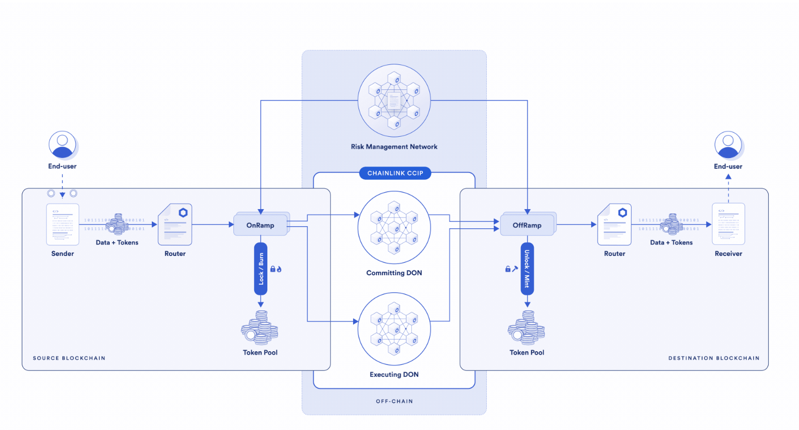

#Mint cross chain NFT using chainlink CCIP
Chainlink CCIP is a blockchain interoperability protocol that enables developers to build secure applications that can transfer tokens, messages (data), or both tokens and messages across chains. That too completely decentralised. You can read more here.
Our project architecture will involve a sender contract on Avalanche Fuji, which will trigger a receiver on the Sepolia network to mint an NFT on Sepolia. The transaction will be initiated on Fuji, while the NFT minting process will occur on Sepolia.

##1.Sender Contract

``` Solidity
// SPDX-License-Identifier: MIT
pragma solidity ^0.8.20;

import {OwnerIsCreator} from "@chainlink/contracts/shared/access/OwnerIsCreator.sol";
import {Client} from "@chainlink/contracts/ccip/libraries/Client.sol";
import {LinkTokenInterface} from "@chainlink/contracts/shared/interfaces/LinkTokenInterface.sol";
import {IRouterClient} from "@chainlink/contracts/ccip/interfaces/IRouterClient.sol";

contract Sender is OwnerIsCreator {
    /////////////////////////////////////////////////////////////////
    ///////////////////////////ERRORS////////////////////////////////
    /////////////////////////////////////////////////////////////////
    error Sender__notEnoughBalance(uint256 currentBalance, uint256 fees);
    /////////////////////////////////////////////////////////////////
    ///////////////////////////EVENT/////////////////////////////////
    //////////////////////////////////////////////////////////////////

    event Sender__messageSent(
        bytes32 indexed messageId, uint64 indexed destinationChainSelector, address receiver, string msg
    );

    LinkTokenInterface private s_linkToken;
    IRouterClient private s_routerClient;

    constructor(address linkToken, address router) {
        s_linkToken = LinkTokenInterface(linkToken);
        s_routerClient = IRouterClient(router);
    }
    /**
     * @param destinationChainSelector Chain destination selector will be different for different for deferent chain
     * @param receiver receiver contract address
     * @param text message you want to send
     */

    function sendMsg(uint64 destinationChainSelector, address receiver, string calldata text)
        external
        returns (bytes32 messageId)
    {
        Client.EVM2AnyMessage memory evm2AnyMessage = Client.EVM2AnyMessage({
            receiver: abi.encode(receiver),
            data: abi.encode(text),
            tokenAmounts: new Client.EVMTokenAmount[](0),
            extraArgs: Client._argsToBytes(
                // Additional arguments, setting gas limit
                Client.EVMExtraArgsV1({gasLimit: 200_000})
            ),
            feeToken: address(s_linkToken)
        });
        uint256 fees = s_routerClient.getFee(destinationChainSelector, evm2AnyMessage);
        if (fees > s_linkToken.balanceOf(address(this))) {
            revert Sender__notEnoughBalance(s_linkToken.balanceOf(address(this)), fees);
        }
        s_linkToken.approve(address(s_routerClient), fees);
        messageId = s_routerClient.ccipSend(destinationChainSelector, evm2AnyMessage);
        emit Sender__messageSent(messageId, destinationChainSelector, receiver, text);
        return messageId;
    }
}
```
This contract primarily consists of a single function, `sendMsg`, which takes three parameters:
1. destinationChainSelector: This parameter differs for each chain, and for Sepolia, it will be 16015286601757825753.
2. Receiver: This is the address of the contract deployed on the Sepolia network.
3. text: This parameter specifies the address of user or the location where the NFT minting should take place.
4. it is deployed on [Fuji](https://testnet.snowtrace.io/address/0x7aEedF5A3346f750dDdCcD050aD32a1F46A6FB54/contract/43113/writeContract?chainid=43113).

##2. Receiver Contract
``` Solidity
// SPDX-License-Identifier: MIT
pragma solidity ^0.8.20;
import {Client} from "@chainlink/contracts/ccip/libraries/Client.sol";
import {CCIPReceiver} from "@chainlink/contracts/ccip/applications/CCIPReceiver.sol";
import {MoodNft} from "../src/MoodNft.sol";

contract Receiver is CCIPReceiver {
    event MessageReceived(
        bytes32 indexed messageId, // The unique ID of the message.
        uint64 indexed sourceChainSelector, // The chain selector of the source chain.
        address sender, // The address of the sender from the source chain.
        string text //The text that was received.
    );

    bytes32 private s_lastReceivedMsgId;
    string private s_lastMsg;
    MoodNft private s_moodNft;

    constructor(address router,address nft) CCIPReceiver(router){
        s_moodNft = MoodNft(nft);
    }
    receive() external payable{}
    function _ccipReceive(
        Client.Any2EVMMessage memory message
    ) internal override {
        s_lastReceivedMsgId = message.messageId;
        s_lastMsg = abi.decode(message.data, (string));
        address creator = stringToAddress(s_lastMsg);
        s_moodNft.mintNft(creator);
        emit MessageReceived(
            message.messageId,
            message.sourceChainSelector, // fetch the source chain identifier (aka selector)
            abi.decode(message.sender, (address)), // abi-decoding of the sender address,
            abi.decode(message.data, (string))
        );
    }

    function getLastReceivedMessageDetails()
        external
        view
        returns (bytes32 messageId, string memory text)
    {
        return (s_lastReceivedMsgId, s_lastMsg);
    }
    function externalCCIPReceive(Client.Any2EVMMessage memory message) external {
        _ccipReceive(message); // for test only not for deployment
    }

    function stringToAddress(string memory str) internal pure returns (address) {
        bytes memory strBytes = bytes(str);
        require(strBytes.length == 42, "Invalid address length");
        bytes memory addrBytes = new bytes(20);

        for (uint i = 0; i < 20; i++) {
            addrBytes[i] = bytes1(hexCharToByte(strBytes[2 + i * 2]) * 16 + hexCharToByte(strBytes[3 + i * 2]));
        }

        return address(uint160(bytes20(addrBytes)));
    }

    function hexCharToByte(bytes1 char) internal pure returns (uint8) {
        uint8 byteValue = uint8(char);
        if (byteValue >= uint8(bytes1('0')) && byteValue <= uint8(bytes1('9'))) {
            return byteValue - uint8(bytes1('0'));
        } else if (byteValue >= uint8(bytes1('a')) && byteValue <= uint8(bytes1('f'))) {
            return 10 + byteValue - uint8(bytes1('a'));
        } else if (byteValue >= uint8(bytes1('A')) && byteValue <= uint8(bytes1('F'))) {
            return 10 + byteValue - uint8(bytes1('A'));
        }
        revert("Invalid hex character");
    }
}
```
This contracts is CCIPreceiver it will receive message from sender and it will mint the NFT. The address we are getting in string stringToAddress will convert to address.
The [NFT](https://sepolia.etherscan.io/address/0xeb2fd9a944b34640ae93b8b2ac7404731a79ca63) and [Receiver](https://sepolia.etherscan.io/address/0x4b5ee188470b7f8b72e9748158d893f1a99323ed#code) contract is deployed on Sepolia.#
